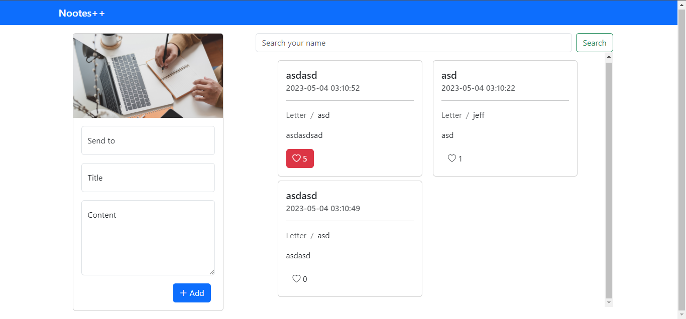

# Nootes++ 
This is a simple php notes app. The purpose of this webiste is for users to send anonymous letters to someone without the need for account creation. All items are stored in the database and not sent to any mails. Database included in the files section.
## Features
* View data
* Filter data
* Like letters
* Send letters
## Access
The sample website is hosted at this site for trying out.
http://nootes.epizy.com/
## Output

this is a modified code using someones code here in github. unfortunately i can't find the original. I'll update it to give credits when possible. New to github.
